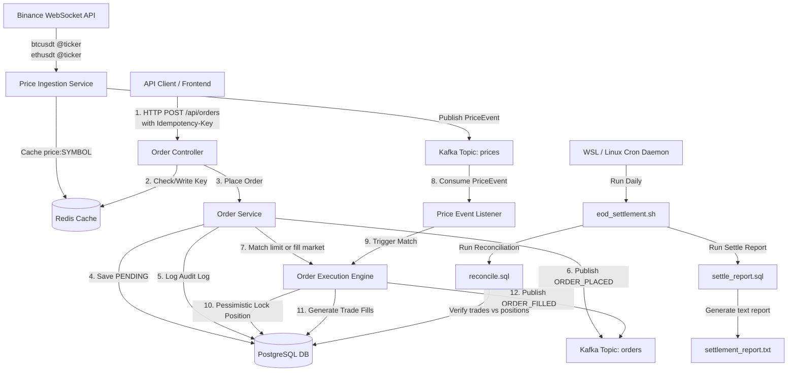

# TradePulse — Real-Time OMS & Market Data Platform

TradePulse is a mini capital-markets backend designed to process high-throughput trading operations. The system features event-driven price ingestion from live market feeds, low-latency limit order execution matching, robust concurrency guards (API idempotency + database pessimistic locking), and automated end-of-day (EOD) settlement scripts.

---

## 1. System Architecture



---

## 2. Core Engineering Features

### A. Low-Latency Event-Driven Matching
Instead of scanning the database periodically, order matching is strictly event-driven. The `order-service` consumes price updates from the `prices` Kafka topic. When a new tick arrives:
1. Pending limit orders for that symbol are fetched immediately.
2. Orders are matched against the market price (Buy limits when price $\le$ limit price; Sell limits when price $\ge$ limit price).
3. Executes fills, logs transactional audits, updates positions, and emits `ORDER_FILLED` events.

### B. High-Volume Concurrency Controls
1. **API Request Idempotency**:
   - Every `POST /api/orders` request requires an `Idempotency-Key` UUID HTTP Header.
   - The key is validated in Redis. Duplicate submissions within 24 hours are blocked immediately (`409 Conflict`), protecting against duplicate order submissions.
2. **Pessimistic DB Locks**:
   - Multiple fills processing concurrently on the same symbol could cause cost-basis/quantity race conditions in the `positions` table.
   - `PositionRepository` uses `@Lock(LockModeType.PESSIMISTIC_WRITE)` to execute a database-level `SELECT ... FOR UPDATE`, guaranteeing thread-safe, sequential updates to cost basis and quantities.

### C. UNIX Cron EOD Settlement Batch Job
- Designed to run inside a Linux/WSL2 context.
- **Position Reconciliation**: Sums all buy (+) and sell (-) trade fill execution quantities per symbol and flags any deviation against the `positions` table.
- **Auditing**: Log runs are persisted into the `audit_log` table under `EOD_SETTLEMENT_SUCCESS` or `EOD_SETTLEMENT_FAILED`.

---

## 3. Technology Stack

- **Core Framework**: Java 17, Spring Boot 3.2.5, Spring Data JPA
- **Database & Migration**: PostgreSQL 15, Flyway
- **Caching & Idempotency**: Redis 7
- **Message Broker**: Apache Kafka 7.4.0 (running in KRaft mode, ZooKeeper-free)
- **Integration Tests**: JUnit 5, Mockito, **Testcontainers** (spinning up native Postgres, Kafka, and Redis containers)
- **CI / CD**: GitHub Actions
- **Quality Gates**: JaCoCo (coverage threshold: 80%)

---

## 4. API Endpoints Reference

### 1. Place Order
* **Method & Path**: `POST /api/orders`
* **Headers**: 
  - `Idempotency-Key: <UUID>` (Required)
  - `Content-Type: application/json`
* **Request Body**:
```json
{
  "symbol": "BTCUSDT",
  "side": "BUY",
  "type": "LIMIT",
  "price": 60000.00,
  "quantity": 0.5
}
```
* **Response Status**: `200 OK` (or `400 Bad Request` on validation failure, `409 Conflict` on duplicate submission)

### 2. Cancel Order
* **Method & Path**: `DELETE /api/orders/{id}`
* **Response Status**: `200 OK` (or `404 Not Found`, `400 Bad Request` if already filled)

### 3. Get Positions
* **Method & Path**: `GET /api/positions`
* **Response Body**:
```json
[
  {
    "symbol": "BTCUSDT",
    "quantity": 0.5,
    "averagePrice": 59500.00,
    "updatedAt": "2026-07-17T12:00:00"
  }
]
```

---

## 5. Development Guide

### Prerequisites
- Java 17
- Maven 3.x or Maven Wrapper (`./mvnw`)
- Docker Desktop (required for executing integration tests and local infrastructure)

### Run Automated Integration Tests (with Testcontainers)
Ensure Docker is running, then execute:
```bash
./mvnw clean verify
```
This command compiles code, starts containers for Kafka, Redis, and Postgres, runs the integration tests, and runs JaCoCo coverage validation checks.

### Running Locally (Docker Compose)
To start the entire network stack locally:
```bash
docker compose up --build -d
```
Once started, the services will run on:
- `order-service`: port `8080`
- `price-ingestion`: port `8081`
- `postgres`: port `5432`
- `redis`: port `6379`
- `kafka`: ports `9092` / `29092`
